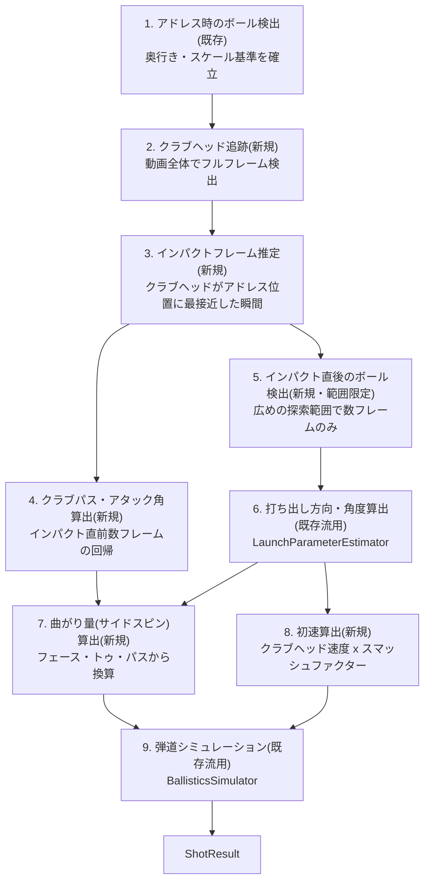

# 設計書: クラブ追跡ベースの弾道解析への方式転換

- 作成日: 2026-08-26
- ステータス: 実装中(Phase 1完了、Phase 2はコード実装完了・実機検証待ち)
- 前提となる調査: [investigation-custom-model-tracking-failure.md](investigation-custom-model-tracking-failure.md)

## 1. 背景・目的

現行の`BallTrajectoryAnalysisService`は、インパクト後にボールを飛球中ずっと画像追跡し続けることで弾道パラメータ(初速・打ち出し角・打ち出し方向)を推定している。しかし[investigation-custom-model-tracking-failure.md](investigation-custom-model-tracking-failure.md)の調査で、以下が判明した。

- インパクト直前、クラブがボールに重なり視覚的に遮蔽するため、その瞬間にモデルの検出信頼度が低下する
- インパクト直後、ボールは秒速数十mで移動するため、33ms間隔・160pxクロップという検出方式では次のフレームで再検出できない
- フルフレーム探索は、小さなボールが640x640へのリサイズで検出困難になるため機能しない

これはコードのバグではなく、**「30fpsの単眼カメラでボールそのものを飛球中に追跡し続ける」というアプローチ自体の限界**である。

一方、市販の(専用機材やスロー撮影を使わない)弾道表示アプリは、後方からの通常速度撮影のみで弾道(左右の曲がりを含む)を表示できている。調査の結果、これらは**ボールを飛ばし続けて観測するのではなく、インパクト時のクラブの挙動から弾道を計算で導いている**と考えられる(Dプレーン理論)。本設計は、この方式へ転換するものである。

## 2. 採用する方式の物理的根拠

ゴルフのボールフライト理論(Dプレーン理論)における2つの経験則を利用する。

1. **打ち出し初期方向は、ほぼフェース角度そのものを反映する**(クラブパスの影響は初期方向にはごくわずか)
2. **曲がり幅は、フェース角度とクラブパスの差(フェース・トゥ・パス)に比例する**

この2つから、以下が導ける。

> フェース角度そのものを検出しなくても、「クラブパス(クラブヘッドの実測)」と「打ち出し初期方向(インパクト直後1〜2フレームのボール実測)」の**両方**が分かれば、フェース・トゥ・パス(＝曲がり幅の要因)を逆算できる。

これにより、以下の2つの技術的難所を両方回避できる。

- ❌ ボールを飛球中ずっと追い続ける(実測済みで不可能と判明)
- ❌ クラブヘッドの回転(フェース角度)を検出する(後述の理由で今回のデータセットでは不可能)

## 3. クラブ検出モデルとその制約

クラブ検出には、[roboflow-model-investigation-guide.md](roboflow-model-investigation-guide.md)で以前候補から外れた**Golf Driver Tracker**(Roboflow Universe、`golf-driver-tracker/2`)を自前ファインチューニングして使う。理由:

- 以前のHosted API実機検証で、`golf ball`クラスは検出できなかったが、`golf club-handle`・`golf club-head`クラスは安定して検出できていた実績がある
- ライセンス(CC BY 4.0)は確認済み

**制約(ユーザーによるブラウザ確認済み、2026-08-26)**: このデータセットのアノテーションは**軸に沿った矩形(通常のバウンディングボックス)のみ**で、回転情報(Oriented Bounding Box)を含まない。そのため、クラブヘッドの向き(真のフェース角度)はこのデータセットからは検出できない。本設計は、この制約を前提に、フェース角度を直接検出しない方式(セクション2)を採用している。

## 4. アーキテクチャ・データフロー

既存の`BallTrajectoryAnalysisService`と並存する形で、新しい`ClubSwingAnalysisService`(`ShotAnalysisService`の別実装)を追加する。



1. **アドレス時のボール検出**(既存・変更なし): タップ位置周辺でボールを検出し、奥行き・スケール基準(`DistanceEstimation`)を確立
2. **クラブヘッド追跡**(新規): 動画全体でクラブヘッド・クラブハンドルを検出。クラブはボールより大きく高コントラストな被写体のため、まずフルフレーム検出を試す(ボールのような狭いROIクロップの要否は実機検証で判断)
3. **インパクトフレームの特定**(新規): クラブヘッドがバックスイングで離れた後、再びアドレス時のボール位置に最も近づいた瞬間をインパクトと推定
4. **クラブパス・アタック角の算出**(新規): インパクト直前の数フレーム(目安5フレーム程度)のクラブヘッド世界座標から線形回帰で算出
5. **インパクト直後のボール検出**(新規・範囲限定): インパクトフレームから数フレームのみ、広めの探索範囲(スロー撮影ではない前提で、想定される最大初速をカバーできるサイズ)でボールを検出
6. **打ち出し方向・角度の算出**(既存流用): 5.で得た1〜2点以上を`LaunchParameterEstimator.estimate()`にそのまま渡す
7. **曲がり量(サイドスピン)の算出**(新規): 6.の打ち出し方向と4.のクラブパスの差(フェース・トゥ・パス)から換算式でサイドスピン量を推定
8. **初速の算出**(新規): 4.のクラブヘッド速度 × クラブ種別ごとのスマッシュファクター
9. **弾道シミュレーション**(既存流用): 6.・7.・8.の結果を`BallisticsSimulator.simulate()`にそのまま渡す

## 5. 新規・変更コンポーネント

| ファイル | 種別 | 内容 |
|---|---|---|
| `lib/data/ml/club_detector.dart` | 新規 | `BallDetector`と同様の構造。`golf club-head`/`golf club-handle`クラスでフィルタしたカスタムYOLOモデルをラップ |
| `lib/domain/models/raw_club_detection.dart` | 新規 | `frameTimeMs`・`centerPx`・`confidence`・`part`(head/handleのenum) |
| `lib/domain/services/club_path_estimator.dart` | 新規(純粋関数) | クラブヘッドの世界座標列からクラブパス角度・アタック角度を線形回帰で算出 |
| `lib/domain/services/impact_moment_detector.dart` | 新規(純粋関数) | クラブヘッド位置列とアドレス時ボール位置から、インパクトフレームを推定 |
| `lib/domain/services/spin_estimator.dart` | 新規(純粋関数) | 打ち出し方向とクラブパスの差(フェース・トゥ・パス)からサイドスピン量(rpm)を換算 |
| `lib/domain/services/club_swing_analysis_service.dart` | 新規 | `ShotAnalysisService`の別実装。上記を結線するオーケストレーション層 |
| `lib/core/club_constants.dart` | 新規 | クラブ種別ごとのスマッシュファクター表 |
| `lib/core/linear_regression.dart` | 新規 | `LaunchParameterEstimator._linearRegressionSlope`を共通ユーティリティとして切り出し、`club_path_estimator.dart`と共用 |
| `lib/core/ballistics_constants.dart` | 変更 | `sidespinRpmPerFaceToPathDegree`(目安値、要チューニング)を追加 |
| `lib/domain/services/shot_analysis_service.dart` | 変更 | `analyze()`に`required ClubType clubType`を追加 |
| `lib/features/club_selection/`(仮) | 新規 | クラブ種別選択画面 |
| `lib/domain/services/launch_parameter_estimator.dart` | 変更なし | インパクト直後1〜2点の推定にそのまま流用 |
| `lib/domain/services/ballistics_simulator.dart` | 変更なし | そのまま流用 |

## 6. 数式・定数

**曲がり量の換算**(`spin_estimator.dart`):

```
faceToPathDegrees = launchDirectionDegrees(ボール実測) - clubPathDegrees(クラブ実測)
sidespinRpm = faceToPathDegrees * BallisticsConstants.sidespinRpmPerFaceToPathDegree
```

`sidespinRpmPerFaceToPathDegree`は目安値としてコード上に明記し、実機データで補正する前提とする(既存の`assumedBackspinRpm`・`assumedSidespinRpm`と同じ「目安値」の扱い)。

**スマッシュファクター表**(`club_constants.dart`、一般的な目安値。要実機検証での補正):

| クラブ種別 | スマッシュファクター(目安) |
|---|---|
| ドライバー | 1.48 |
| フェアウェイウッド | 1.45 |
| ユーティリティ | 1.41 |
| アイアン(中番手目安) | 1.33 |
| ウェッジ | 1.25 |

**バックスピン量**: 今回のスコープでは真の測定手段が無いため、既存の`BallisticsConstants.assumedBackspinRpm`(固定仮定値)を変更せず流用する。バックスピン推定(≈飛距離・高さの精度向上)は本設計のスコープ外とする(セクション9参照)。

## 7. UI変更

`ball_position_picker_screen.dart`の前後に、クラブ種別選択ステップを追加する。ユーザーが解析前にクラブ種別(ドライバー/FW/UT/アイアン/ウェッジ等)を選択し、`ClubType`として`ClubSwingAnalysisService.analyze()`に渡す。

## 8. エラーハンドリング

既存の`InsufficientTrajectoryDataException`パターンを踏襲し、失敗箇所が分かるメッセージを追加する。

- 「クラブヘッドを検出できませんでした」(手順2で検出0件)
- 「インパクトの瞬間を特定できませんでした」(手順3で妥当な最接近点が見つからない)
- 「インパクト直後のボールを検出できませんでした」(手順5で1点も検出できない、または`LaunchParameterEstimator`が要求する2点に満たない)

## 9. スコープ外・今後の課題

- **バックスピン量の実測**: 今回は固定仮定値のまま。アタック角・(可能であれば)ロフト角からの推定は将来検討
- **芯を外した打点(ギア効果)の考慮**: 今回のフェース・トゥ・パスによる曲がり推定は、芯で捉えたショットを前提とした簡易モデル。ミスヒット時の追加サイドスピンは考慮しない
- **クラブ検出のROI最適化**: 手順2はまずフルフレーム検出で試す想定。実機検証で精度・速度が不十分な場合、ボールと同様のROIクロップ方式の導入を検討する

## 10. リスク・フォールバック方針

**最大のリスク**: セクション2の物理的根拠(打ち出し初期方向 ≈ フェース角度)は一般論としては妥当だが、実機の検出精度(クラブパスの測定誤差・インパクト直後のボール検出精度)次第では、曲がり幅の推定精度が実用に耐えない可能性がある。

**フォールバック方針**: 上記の方式で十分な精度が得られないと判明した場合、**回転情報(Oriented Bounding Box)を含むデータセットでのクラブヘッド検出モデルに切り替え、真のフェース角度を直接検出する方式への再設計が必要になる**。その場合、以下のいずれかの対応が必要:

- 回転情報を含む既存のRoboflow Universe公開データセットを新たに探す
- Golf Driver Trackerのデータセットの一部を自分でOBBアノテーションし直す(要ブラウザでのアノテーション作業)

いずれの場合も、`docs/roboflow-model-investigation-guide.md`と同様の調査手順(候補データセットの重み入手可否・ライセンス確認)を踏む必要がある。

## 11. 実装TODOリスト(Phase別)

Phaseごとに1つのPRとして完結させる想定。各Phase末尾の完了確認項目まで終わったら次のPhaseへ進む。

**方針確認済み(2026-08-26)**: `ClubSwingAnalysisService`は`BallTrajectoryAnalysisService`を完全に置き換える(UIの分岐は作らない)。既存の`BallTrajectoryAnalysisService`はテスト・参考実装として残すが、本番の解析フローからは外す。

### Phase 1: 基盤整備(共通ユーティリティ・定数・モデル定義)

- [x] `lib/core/linear_regression.dart`を新設し、`LaunchParameterEstimator._linearRegressionSlope`をここに切り出す(既存の`launch_parameter_estimator_test.dart`が通ることを確認)
- [x] `lib/core/club_constants.dart`を新設(`ClubType` enumとスマッシュファクター表)
- [x] `lib/core/ballistics_constants.dart`に`sidespinRpmPerFaceToPathDegree`を追加
- [x] `lib/domain/models/raw_club_detection.dart`を新設(`ClubPart` enum: head/handle)
- [x] `lib/domain/services/shot_analysis_service.dart`の`analyze()`に`required ClubType clubType`を追加(既存`BallTrajectoryAnalysisService`側も引数を受け取るだけに更新してビルドを通す)
- [x] Phase完了確認: `fvm flutter analyze`・`fvm flutter test`が通ることを確認

**完了(2026-08-26、[PR #12](https://github.com/rei1011/DAN-DO/pull/12))**: `analyze()`のシグネチャ変更に伴い、設計時点では想定していなかった呼び出し元(`AnalysisController`・`AnalyzingScreen`・`BallPositionPickerScreen`)とそのテストもビルドを通すため追従修正した。クラブ種別選択UIはまだ無いため、`BallPositionPickerScreen`は暫定的に`ClubType.driver`固定値を渡している(`TODO(Phase5)`コメント付き、Phase 5で実際の選択UIに置き換え予定)。アプリの実行時挙動(解析ロジック・画面遷移)はPhase 1では変化していない。

### Phase 2: クラブ検出モデルの学習・組み込み

- [x] Golf Driver Tracker(`golf-driver-tracker/2`)のDatasetをRoboflowからダウンロード(YOLO26形式、Show download code)
- [x] Colabで`yolo26n`をファインチューニング(club-head/club-handle。手順は`club-detector-training-guide.md`のノートブック構成を流用)
- [x] `.mlpackage`をZIP化して`assets/models/`に配置、`pubspec.yaml`更新
- [x] `lib/data/ml/club_detector.dart`を実装(`BallDetector`と同様の構造)
- [x] `docs/model-provenance.md`にクラブ検出モデルの出典・ライセンス(CC BY 4.0)を追記
- [ ] Phase完了確認: 実機で`ClubDetector`単体がクラブヘッド・ハンドルを検出できることを確認

**進捗(2026-08-26)**: Roboflowデータセットダウンロード・Colabでのファインチューニングはユーザー作業として完了(手順は新設の[club-detector-training-guide.md](club-detector-training-guide.md)にまとめた)。学習済みモデルの検出クラスは`golf ball`・`golf club-handle`・`golf club-head`の3クラスで、本アプリでは`golf club-head`・`golf club-handle`のみを`club_detector.dart`で使用(ボール検出は引き続き別モデル`ball_detector.dart`が担当)。モデルは`assets/models/best_club.mlpackage.zip`として配置。学習成果物のうち`best.pt`・`best.tflite`・`last.pt`はリポジトリには含めず(ボール検出モデルと同じ方針)、ユーザーの手元に保管。`fvm flutter analyze`・`fvm flutter test`(53件)は問題なし。実機での`ClubDetector`単体動作確認は未実施(ユーザー側での確認待ち)。

### Phase 3: クラブパス・インパクト検出・スピン推定ロジック(純粋関数)

- [ ] `lib/domain/services/club_path_estimator.dart`を実装+単体テスト(TDD)
- [ ] `lib/domain/services/impact_moment_detector.dart`を実装+単体テスト(TDD)
- [ ] `lib/domain/services/spin_estimator.dart`を実装+単体テスト(TDD)
- [ ] Phase完了確認: `fvm flutter test`が通ることを確認

### Phase 4: ClubSwingAnalysisServiceの実装(オーケストレーション)

- [ ] `lib/domain/services/club_swing_analysis_service.dart`を実装し、Phase 1〜3の要素を結線
- [ ] `ball_trajectory_analysis_service_analyze_test.dart`を参考に、モックを使った結線テストを作成
- [ ] Phase完了確認: `fvm flutter test`が通ることを確認

### Phase 5: UI統合・既存フローの置き換え

- [ ] クラブ種別選択画面を新設(`lib/features/club_selection/`)
- [ ] 動画選択 → ボール位置指定 → クラブ種別選択 → 解析、の画面遷移に組み込む
- [ ] `shotAnalysisServiceProvider`の実装を`ClubSwingAnalysisService`に切り替える(`BallTrajectoryAnalysisService`は削除せずテスト・参考実装として残す)
- [ ] Phase完了確認: 実機で一連の画面遷移(動画選択→クラブ種別選択→ボール位置指定→解析→結果表示)が動くことを確認
- [ ] Phase完了確認: `fvm flutter analyze`・`fvm flutter test`が通ることを確認

### Phase 6: 実機検証・定数チューニング

- [ ] 実際のスイング動画で一連のフローがエラーなく完走することを確認
- [ ] 弾道の見た目の妥当性(可能であれば実測値)と比較し、`sidespinRpmPerFaceToPathDegree`・スマッシュファクター表を補正
- [ ] 本ドキュメントのセクション10(リスク・フォールバック方針)を、実機検証結果を踏まえて更新(精度が実用に耐えるか、フォールバックが必要かを記録)
